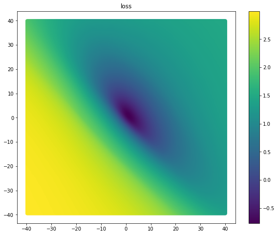
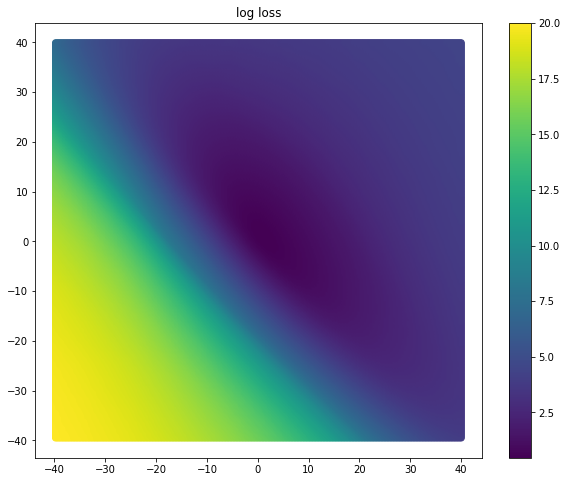
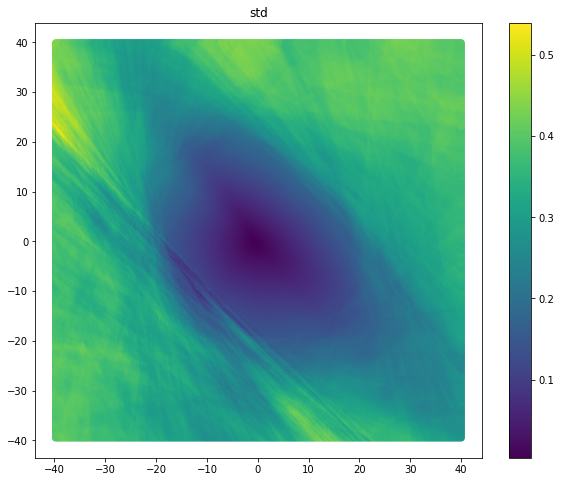
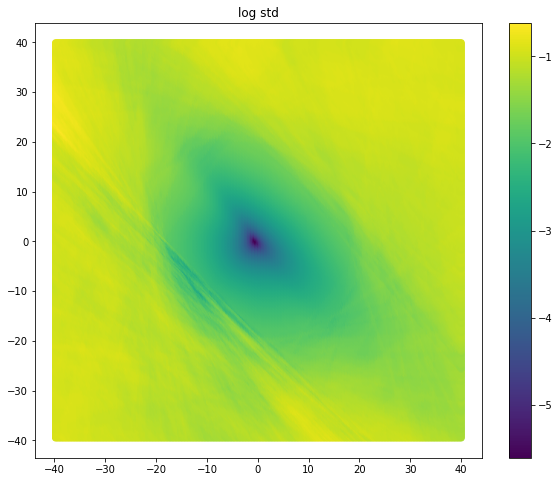

MNIST is the hello world of machine learning. When we learn our optimizer is moving through peaks and valleys which correspond to local minima and maxima. But how bumpy are those valleys and how many are there? To get some kind of intuition for the problem, this project tries to visualize the landscape.

To do this we map mnist as we vary two nuerons. We reduce mnist to a binary problem (is the number less than 5), and reduce the dimensionality with a single conv2d layer. There are no hidden layers, and the head is a dense layer with two neurons: nueron x and nueron y. For our z axis we use loss.

The result is quite smooth and covex, but perhaps that's a result of how I set up the problem.

Steps:
- Pre-train a model
- freeze all but the x and y neurons parameters.
- Then we peform a grid search over x and y to find the loss at differen't points.
    - Records loss, loss variance, gradient, gradient variance
- Visualize the result

Results:

